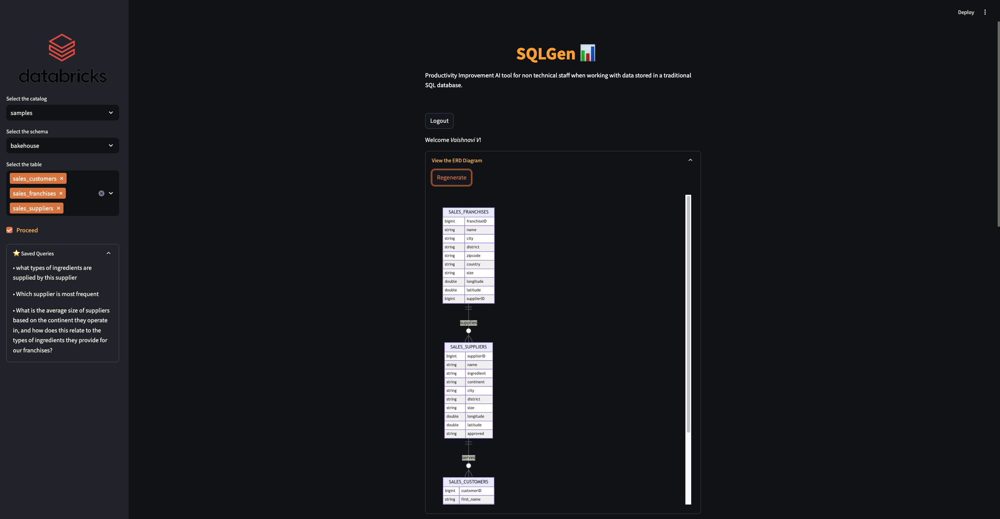
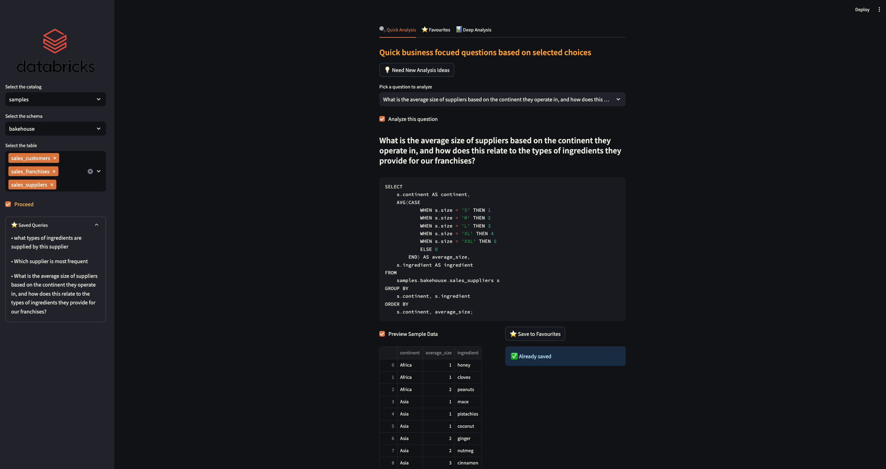
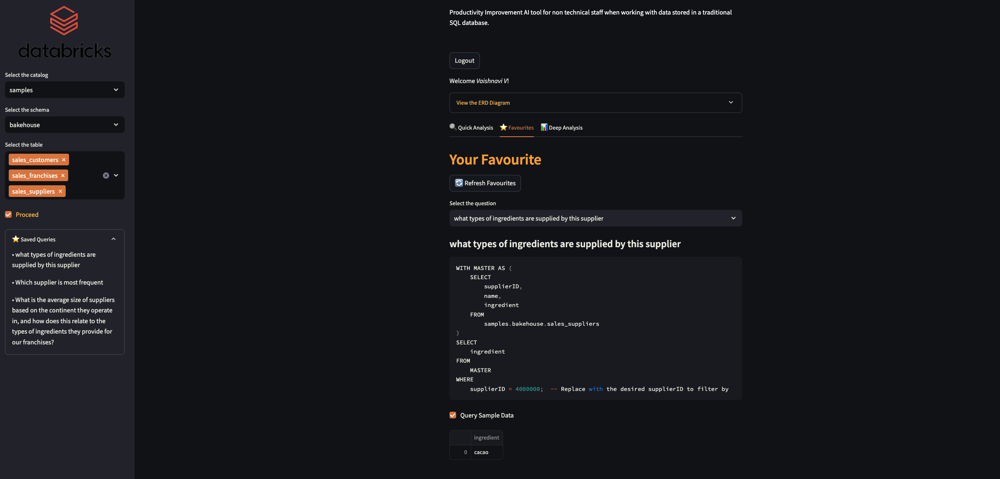
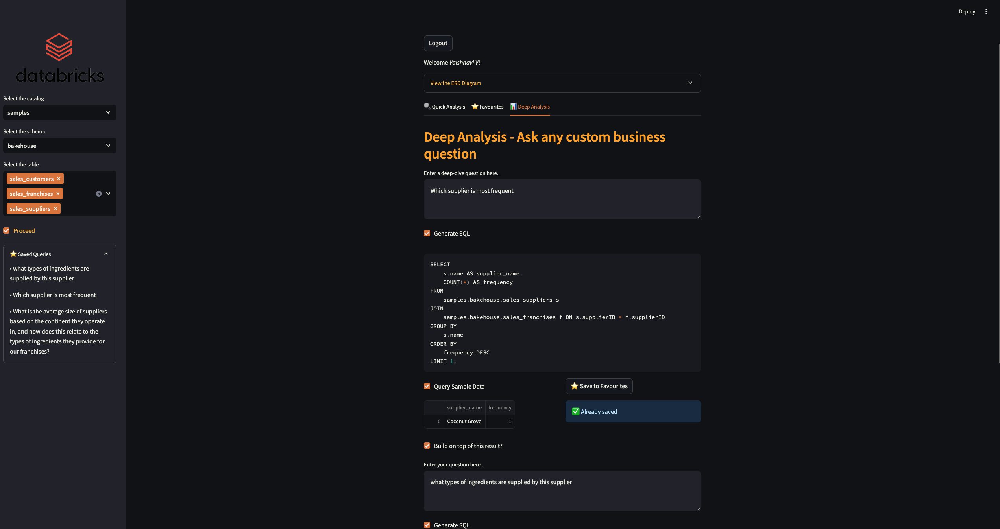

# SQLGen 🧠

**SQLGen** is a productivity tool designed to help Product Managers, Business Stakeholders, and intermediate coders interact with SQL databases—specifically Databricks—using natural language.

It simplifies query generation, schema exploration, and analysis with a Streamlit-based UI and secure login system.

### 🎞 Demo (GIF Preview)


### 📹 Watch Full Demo (MP4)

[](artifacts/sqlGenDemo2x.mp4)

### 🖼 App Screenshot





---

## 🚀 Features

- 🔐 Login system via `streamlit_authenticator`
- 📊 Natural language to SQL query generation
- 🧱 Works with Databricks Unity Catalog
- 🗺️ Auto-generated ERD diagrams with Mermaid.js
- 📌 Save and view query history
- ⚡ Quick and deep analysis modes
- 🔁 SQL self-correction loop

---

## ✅ Prerequisites

- Python 3.10
- Access to a Databricks SQL Warehouse
- Databricks Python connector or other setup in `src/utils.py`
- Optional but recommended: environment variables for secure access

---

## 📦 Installation & Setup

### Clone the repository

```bash
git clone https://github.com/vaishnavivisweswaraiah/sql-gen-ai-application.git
cd text_2_sql_genAI_application
```
### Create and activate a virtual environment
#### On Mac/Linux:
```bash
python3 -m venv venv
source venv/bin/activate
```
#### On Windows
```bash
python -m venv venv
.\venv\Scripts\activate
```
### Install dependencies
```bash
pip install -r requirements.txt
```
### 🔐 Authentication Setup
SQLGen uses streamlit_authenticator for user login and session management.

#### Create a file called authenticator.yml in your project root:
<summary>Sample `authenticator.yml`</summary>

```yaml
credentials:
  usernames:
    your_username:
      email: your_email@example.com
      name: Your Full Name
      password: your_bcrypt_password_hash  # e.g. $2b$12$...

cookie:
  expiry_days: 10
  key: your_secure_cookie_key       # Replace with a secure, random string
  name: your_cookie_name            # Custom session cookie name

preauthorized:
  emails:
    # - your_email@example.com         # Optional: allow auto-login for certain users
```

#### Generate a hashed password
Run this python snippet:
```python
from streamlit_authenticator.utilities.hasher import Hasher

hashed_passwords = Hasher(['your_plaintext_password']).generate()
print(hashed_passwords)
```
Copy the output and use it as the value for password in authenticator.yml

Copy the output and use it as the value for password in authenticator.yml.

### Create .env file to store API keys

```bash
OPENAI_API_KEY="<<key>>"
DATABRICKS_ACCESS_TOKEN="<<key>>"
DATABRICKS_HTTP_PATH="<<path>>" # example "/sql/1.0/warehouses/<<id>>>}"
DATABRICKS_SERVER_HOSTNAME="<<key>>"
```

### 🧱 Databricks Setup
Make sure your Databricks SQL Warehouse is ready. Use this optional SQL to prepare schema and query history storage:
```sql
CREATE SCHEMA IF NOT EXISTS hive_metastore.dev_tools;

CREATE TABLE IF NOT EXISTS hive_metastore.dev_tools.sqlgen_user_query_history (
  user_name STRING,
  timestamp TIMESTAMP,
  question STRING,
  query STRING,
  favourite BOOLEAN
);
```

### ▶️ Running the App
Start the application using Streamlit:
```bash
streamlit run SQLGen.py
```
Then visit http://localhost:8501 in your browser.

## 🗂️ Project Structure
```css
sql-gen-ai-application/
├── .streamlit/                   # Streamlit UI configuration
│   └── config.toml               # Theme and layout settings
├── artifacts/                    # Static assets
│   └── Databricks_Logo.png       # Logo displayed in sidebar
├── src/                          # Main application logic
│   ├── utils.py                  # Core SQLGen functions (querying, ERD, etc.)
├── .env                          # Contains API keys
├── .gitignore                    # Excludes .env, dev folders, cache, etc.
├── README.md                     # Project documentation (you're reading it!)
├── SQLGen.py                     # Main Streamlit application
├── authenticator.yml             # User authentication config (git-ignored)
├── helper.ipynb                  # Optional Jupyter exploration notebook
├── requirements.txt              # Python dependency list

```

